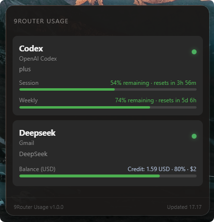

# 9Router Usage

[](LICENSE)
[](https://tauri.app)
[](#requirements)
[](https://apps.microsoft.com/detail/9NR91D484XF6)

A lightweight Windows system-tray application for monitoring provider quotas and credit balances from a local or remote [9Router](https://github.com/decolua/9router) instance.

<p align="center">
  
</p>

## Features

- Connect to any 9Router instance, including the default local API endpoint at `http://localhost:20128/v1`.
- Monitor all provider connections exposed by the 9Router dashboard API.
- Display remaining quota, reset countdowns, account names, plans, and provider status.
- Display monetary credit balances such as DeepSeek in USD.
- Configure a local reference budget for credit providers and show it as a progress bar.
- Automatically refresh in the background, with configurable intervals and manual refresh.
- Native Windows notifications when quota or credit becomes low.
- Secure optional password storage using Windows Credential Manager.
- English and Indonesian interface languages.
- Filter inactive providers and sort by dashboard order, active status, lowest quota, or name.
- Dynamic popup height with a minimum size and scrolling only when required.
- System tray integration, auto-hide on focus loss, optional pinning, and autostart support.
- Dark Windows 11-style interface powered by Tauri 2.

## Requirements

- Windows 10 or Windows 11 x64
- A running [9Router](https://github.com/decolua/9router) instance (local or remote)
- Microsoft Edge WebView2 Runtime, normally included with Windows 11

The default server URL is:

```text
http://localhost:20128/v1
```

This matches the API Endpoint shown in the 9Router dashboard, so it can be copied and pasted directly. URLs without the `/v1` suffix remain supported. Remote HTTP, HTTPS, IP address, hostname, and custom-port installations can be configured from the connection screen or Settings.

## Installation

Install from the [Microsoft Store](https://apps.microsoft.com/detail/9NR91D484XF6) after the listing becomes publicly available, or download the latest Windows installer from this repository's **Releases** page.

Typical release artifacts:

```text
9Router-Usage_1.0.1_x64-setup.exe
9Router-Usage_1.0.1_x64_en-US.msi
9Router-Usage-1.0.1-portable-x64.zip
9Router-Usage-1.0.1-store-x64.msix
checksums.txt
```

Use the `.exe` or `.msi` package for a normal installation. Alternatively, extract the portable `.zip` and run `9Router Usage.exe` directly without installation. Portable mode still stores settings in `%APPDATA%\9RouterUsage` and, when enabled, passwords in Windows Credential Manager.

After launching the application, open it from the Windows system tray and enter your 9Router dashboard password. When **Remember password securely** is enabled, the password is stored in Windows Credential Manager and used for automatic login.

## Usage

1. Start your 9Router server.
2. Launch 9Router Usage.
3. Click its icon in the Windows system tray.
4. Enter the 9Router server URL and dashboard password.
5. Use the refresh button to force a quota update, or let the application refresh automatically.
6. Open Settings to configure language, refresh interval, provider sorting, notifications, inactive-provider filtering, secure password storage, and autostart.

Closing the popup hides it to the tray. Use the tray menu to show or quit the application.

## Local Development

### Prerequisites

- [Node.js 20+](https://nodejs.org)
- [Rust](https://rustup.rs) with the `x86_64-pc-windows-msvc` toolchain
- Visual Studio Build Tools with **Desktop development with C++**
- Microsoft Edge WebView2 Runtime

### Run in development mode

```powershell
npm install
npm run tauri dev
```

Run the project from native Windows PowerShell rather than WSL. A native Windows build should launch an executable ending in `.exe` and should not show GTK or Mesa messages.

### Validate the project

```powershell
npm run build
cargo check --manifest-path src-tauri/Cargo.toml
```

### Build installers

```powershell
npm run tauri build
```

Generated installers are placed under:

```text
src-tauri\target\release\bundle
```

## Release Workflow

The workflow in `.github/workflows/release.yml` builds Windows installers, a portable archive, an unsigned Microsoft Store MSIX, and SHA-256 checksums when a version tag is pushed:

```powershell
git tag v1.0.1
git push origin v1.0.1
```

The Store MSIX uses the reserved identity `afridho.9RouterUsage` and is intentionally unsigned for direct Partner Center submission. See [STORE_SUBMISSION.md](STORE_SUBMISSION.md) for build and certification instructions.

## Architecture

- **Tauri 2 / Rust** — system tray, native window behavior, secure credential access, notifications, polling, and 9Router API communication
- **React 19 / TypeScript** — popup interface and settings
- **Vite** — frontend development and production builds
- **Windows Credential Manager** — optional secure password persistence

## 9Router API Usage

The application communicates with the configured 9Router dashboard through endpoints such as:

```text
POST /api/auth/login
GET  /api/auth/status
POST /api/auth/logout
GET  /api/providers
GET  /api/usage/{connectionId}
GET  /api/usage/stats?period=7d
```

Quota responses from different providers are normalized by the Rust backend before being sent to the UI.

## Privacy and Security

- The dashboard password is sent only to the configured 9Router server.
- When password remembering is enabled on Windows, credentials are stored in Windows Credential Manager, separated by server hostname.
- Passwords are not written to `settings.json` or bundled into the frontend.
- Disconnecting removes the saved credential for the active server.
- The application does not include analytics, advertising, or tracking SDKs.

See the complete [Privacy Policy](PRIVACY.md).

## License

Licensed under the [MIT License](LICENSE).
